# Architecture

## Overview

This project is a Python pygame Tetris game with an embedded Deep Q-Network (DQN) AI agent. The architecture follows a modular, layered design with a Finite State Machine (FSM) driving navigation between menus, gameplay, AI training, and statistics views.

**Core principles:**
- **Packages over monolithic files** — code is organized in packages (`game/`, `audio/`, `visuals/`, `states/`, `storage/`, `bots/`, `ai/`) each with a clear responsibility
- **DRY (Don't Repeat Yourself)** — shared logic centralized (e.g., `draw_leaderboard()` in `visuals/leaderboard_view.py`, scoring in `settings.py`)
- **KISS (Keep It Simple)** — each module is small and does one thing; `main.py` is a 10-line entry point
- **SOLID** — single responsibility, open/closed, dependency inversion applied throughout
- **SLAP (Single Layer of Abstraction)** — each function operates at one abstraction level

## Data Flow

```
main.py → tetris.run() → TetrisApp.run()
                            │
                            └─ FSM loop (60 FPS):
                                 1. event.get() → state.handle_event(event) → Optional[State]
                                 2. state.update(dt, particles)            → Optional[State]
                                 3. state.draw(screen)
                                 4. display.flip() + particles.update()
```

Returning a new `State` from `handle_event` or `update` transitions the app; `None` stays. Concrete states are imported lazily inside methods to avoid import cycles.

## Layering

The codebase follows a three-layer architecture:

| Layer | Packages | Responsibility |
|-------|----------|----------------|
| Domain | `tetris/game/` | Pure game logic: board, tetromino, scoring, stats, piece provider, rules (SRS kicks, collision, line clear) |
| Presentation | `tetris/visuals/`, `tetris/audio/`, `tetris/states/` | Rendering, particle effects, procedural SFX/MIDI music, FSM states binding input → game logic → rendering |
| Persistence | `tetris/storage/` | JSON load/save for leaderboard, human stats, settings |

## Package Structure

```
tetris/
├── app.py                    # TetrisApp — main loop, pygame init, state dispatch
├── run.py                    # Entry point function
├── settings.py               # All constants, path constants, keybinds, labels
├── logger.py                 # Central logging (configure_logging, get_logger)
├── mcp_server.py             # MCP HTTP server (FastMCP)
├── verify_training.py        # Headless training validation script
├── game/                     # Pure domain logic
│   ├── board.py              # Board class — grid, collision, locking, line clear, handicap
│   ├── tetromino.py          # Tetromino class — stateful piece model
│   ├── shapes.py             # SHAPES dict (SRS rotation states), SHAPES_TYPES, helpers
│   ├── stats.py              # GameStats, ClearCounts dataclasses
│   ├── piece_provider.py     # PieceProvider facade + PieceGenerator hierarchy
│   ├── scoring.py            # ScoreEngine — points, T-spin, B2B
│   └── rules.py              # Grid-agnostic game rules (collision, rotation, hard drop, line clear)
├── visuals/                  # Rendering + particles
│   ├── renderer.py           # Renderer — pure presentation, draws game state
│   ├── particles.py          # ParticleSystem — physics-based effects
│   └── leaderboard_view.py   # Shared leaderboard rendering
├── audio/                    # Procedural audio
│   ├── __init__.py           # AudioManager — NumPy SFX + MIDI polyphonic music
│   └── midi_gen.py           # MIDI file generation (Korobeiniki, Kalinka)
├── states/                   # FSM states
│   ├── base.py               # State base class contract
│   ├── menu.py               # MenuState — root menu, settings load/save
│   ├── game.py               # GameState — abstract base: board, pieces, gravity, lock delay
│   ├── human.py              # HumanState — human gameplay: keyboard, DAS, pause
│   ├── ai.py                 # AIState — AI gameplay + RL training integration
│   ├── dellacherie.py        # DellacherieState — Dellacherie bot gameplay
│   ├── bot_menu.py           # BotMenuState — Dellacherie sub-menu
│   ├── mcp.py                # MCPState — external agent via HTTP
│   ├── mcp_menu.py           # MCPMenuState — MCP sub-menu
│   ├── seed_entry.py         # SeedEntryState — numeric seed input
│   ├── human_menu.py         # HumanMenuState, KeybindState, HumanStatsState
│   ├── ai_menu.py            # AIMenuState, TrainingMenuState, AIStatsState
│   ├── game_rules_menu.py    # GameRulesMenuState — generator, preview, handicap, speed, ghost
│   ├── audio_menu.py         # AudioMenuState — volume, song selection
│   └── leaderboard.py        # LeaderboardState
├── bots/                     # Shared bot algorithm library
│   ├── moves.py              # BotMovesMixin — candidate enumeration + BFS move replay
│   └── dellacherie.py        # dellacherie_pick — pure argmax selection
├── ai/                       # V-network DQN agent
│   ├── agent.py              # DQNAgent — select_action, store, learn, save, load
│   ├── network.py            # DQNetwork — 17→256→128→1 V-network MLP
│   ├── candidates.py         # Placement generation + soft-drop BFS
│   ├── hud.py                # AI training HUD rendering
│   └── rewards.py            # DT-20 features, PBRS reward, El-Tetris evaluation
└── storage/                  # JSON persistence
    ├── leaderboard.py        # Leaderboard load/save
    └── human_stats.py        # Human game history load/save
```

## FSM State Machine

The FSM is the central control flow. Each state implements `handle_event()`, `update()`, and `draw()`. Transitions happen by returning a new state instance.

```mermaid
stateDiagram-v2
    [*] --> MenuState
    MenuState --> GameRulesMenuState : Règles du jeu
    MenuState --> HumanMenuState : Humain
    MenuState --> AIMenuState : IA
    MenuState --> BotMenuState : Bot
    MenuState --> MCPMenuState : MCP
    MenuState --> AudioMenuState : Audio
    MenuState --> LeaderboardState : Leaderboard
    MenuState --> [*] : Quitter

    HumanMenuState --> SeedEntryState : Mode Normal/Replay
    HumanMenuState --> KeybindState : Touches
    HumanMenuState --> HumanStatsState : Statistiques
    HumanMenuState --> MenuState : Retour

    AIMenuState --> TrainingMenuState : Apprentissage
    AIMenuState --> AIStatsState : Statistiques
    AIMenuState --> MenuState : Retour

    TrainingMenuState --> HyperparamMenuState : Hyperparamètres
    TrainingMenuState --> MenuState : Retour

    GameRulesMenuState --> MenuState : Retour

    BotMenuState --> MenuState : Retour

    MCPMenuState --> MenuState : Retour

    AudioMenuState --> MenuState : Retour

    MenuState --> HumanState : Démarrer (Joueur=Humain)
    MenuState --> AIState : Démarrer (Joueur=IA)
    MenuState --> DellacherieState : Démarrer (Joueur=Bot)
    MenuState --> MCPState : Démarrer (Joueur=MCP)

    HumanState --> GameOverState : Game Over
    AIState --> AIState : Episode reset (auto)
    DellacherieState --> MenuState : Game Over
    MCPState --> MenuState : Game Over / Disconnect

    GameOverState --> MenuState : Name entered / ESC

    HumanState --> MenuState : Pause → Quitter
    AIState --> MenuState : Not applicable (no pause menu)
    DellacherieState --> MenuState : Not applicable
    MCPState --> MenuState : Disconnect
```



## Key Architectural Patterns

### 1. State Pattern (FSM)

All game modes are states inheriting from `State` base class. The `TetrisApp` holds a reference to the current state and calls `handle_event()`, `update()`, `draw()` each frame. State transitions are explicit returns.

### 2. Shared Game Logic Base

`GameState` is an abstract base class containing all shared gameplay logic:
- Board, piece provider, stats, gravity, lock delay
- Movement primitives (`_move`, `_rotate_cw`, `_rotate_ccw`, `_hard_drop`, `_hold`)
- Scoring, line clearing, level progression
- Ghost piece rendering

Concrete states (`HumanState`, `AIState`, `DellacherieState`, `MCPState`) inherit from `GameState` and only override input handling and decision-making.

### 3. Shared Bot Library (`tetris/bots/`)

`BotMovesMixin` provides candidate enumeration (`_get_candidate_states`) and BFS move replay (`_execute_move_sequence`). Both `AIState` and `DellacherieState` inherit this mixin. The `dellacherie_pick` function in `dellacherie.py` is a pure argmax selection.

This eliminates duplicate candidate generation code between the AI and the Dellacherie bot.

### 4. Grid-Agnostic Rule Engine (`tetris/game/rules.py`)

All game rules (collision detection, SRS rotation, hard drop, line clear, piece placement) are implemented once in `rules.py` as pure functions operating on an abstract grid interface. Two implementations exist:
- `Board` uses list-of-lists with color tuples (authoritative for gameplay)
- AI simulation uses numpy arrays for vectorized feature extraction

Both paths call the same rule functions — one rule engine, two representations.

### 5. Settings Owner Pattern

`MenuState` owns all settings. It loads/saves `data/settings.json`. Child menu states hold a reference to `MenuState` and mutate its attributes directly, then trigger `save_settings()`. This avoids propagating settings through multiple layers.

### 6. Procedural Audio

`AudioManager` generates SFX via NumPy sine waves with envelopes. Music is loaded from MIDI files (generated by `midi_gen.py` if missing), parsed, and synthesized into a polyphonic audio buffer at runtime. Tempo scaling regenerates the buffer at `1/_music_speed` duration.

## Logging and Debug Mode

`tetris/logger.py` centralizes logging via Python `logging`. `configure_logging(debug)` configures the root logger `tetris`:
- **Debug OFF** (default): level WARNING — only errors written to `data/debug.log`
- **Debug ON**: level DEBUG — all events written to `data/debug.log`

The debug flag is toggled via the main menu (persisted in `settings.json`). During gameplay, pressing **`d`** toggles the visual debug overlay (7-bag visualization, speed info, hole/overhang debug) on all player types — this flips `GameState.debug` live without changing the logging level.

## Data Files

All runtime-generated files live in `data/` (gitignored):

| File | Path Constant | Purpose |
|------|---------------|---------|
| `settings.json` | `SETTINGS_PATH` | Menu prefs, AI hyperparams, keybinds, debug flag |
| `leaderboard.json` | `LEADERBOARD_PATH` | Top 10 scores (capped) |
| `human_stats.json` | `HUMAN_STATS_PATH` | Unbounded human game history |
| `ai_model.pt` | `MODEL_PATH` | DQN weights + optimizer + epsilon |
| `ai_training_log.json` | `LOG_PATH` | Per-episode training metrics (35 fields) |
| `ai_step_log.jsonl` | `STEP_LOG_PATH` | Per-`learn()`-call metrics (rotates at 1M lines) |
| `ai_behavior_log.jsonl` | `BEHAVIOR_LOG_PATH` | Per-episode behavioral analytics |
| `ai_playing_log.json` | `PLAYING_LOG_PATH` | Per-episode playing-mode metrics |
| `ai_playing_behavior_log.jsonl` | `PLAYING_BEHAVIOR_LOG_PATH` | Playing-mode behavioral analytics |
| `runs/` | `TB_LOG_DIR` | TensorBoard event files |
| `replay_pieces.json` | `REPLAY_PATH` | Stored piece sequences for Replay mode |

## Media Files

| File | Path Constant | Purpose |
|------|---------------|---------|
| `media/korobeiniki.mid` | `MUSIC_SONG_PATHS["korobeiniki"]` | Korobeiniki music (melody + bass) |
| `media/kalinka.mid` | `MUSIC_SONG_PATHS["kalinka"]` | Kalinka music (melody + bass) |

## Class Diagram

The exhaustive Mermaid class diagram is maintained in the source of this document.

```mermaid
classDiagram
    %% ===== tetris.app =====
    class TetrisApp {
        +screen: pygame.Surface
        +clock: pygame.time.Clock
        +font: pygame.font.Font
        +audio: AudioManager
        +particles: ParticleSystem
        +state: State
        +menu: MenuState
        +__init__()
        +run()
        +_frame()
    }

    %% ===== tetris.states.base =====
    class State {
        <<abstract>>
        +handle_event(event): State | None
        +update(dt, particles): State | None
        +draw(screen): None
    }

    %% ===== tetris.states.menu =====
    class MenuState {
        +screen: pygame.Surface
        +font: pygame.font.Font
        +audio: AudioManager
        +particles: ParticleSystem
        +selected: int
        +player: str
        +mode: str
        +handicap: int
        +sound_volume: int
        +music_volume: int
        +song: str
        +debug: bool
        +ghost_piece: bool
        +preview_count: int
        +piece_generator: str
        +speed_mode: str
        +ai_speed: str
        +ai_epsilon_decay: float
        +ai_epsilon_end: float
        +ai_lr: float
        +ai_gamma: float
        +ai_batch_size: int
        +ai_buffer_size: int
        +ai_mode: str
        +ai_curriculum: bool
        +ai_curriculum_freq: int
        +ai_curriculum_epsilon: str
        +ai_warm_start: bool
        +ai_learn_per_action: int
        +ai_lookahead: bool
        +ai_lookahead_depth: int
        +mcp_port: int
        +bot_lookahead: str
        +seed: int | None
        +keybinds: dict
        +_load_settings()
        +save_settings()
        +handle_event(event)
        +update(dt, particles)
        +draw(screen)
    }

    %% ===== tetris.states.game =====
    class GameState {
        +board: Board
        +pieces: PieceProvider
        +stats: GameStats
        +current_piece: Tetromino
        +next_piece: str
        +hold_piece: str | None
        +_can_hold: bool
        +gravity_timer: float
        +lock_delay_timer: float
        +lock_delay_resets: int
        +paused: bool
        +ghost_piece: bool
        +preview_count: int
        +debug: bool
        +_drop_interval(level)
        +_spawn_piece()
        +_move(dx)
        +_rotate_cw()
        +_rotate_ccw()
        +_hard_drop()
        +_hold()
        +_lock_and_spawn()
        +_do_game_over()
        +update(dt, particles)
        +draw(screen)
    }

    %% ===== tetris.states.human =====
    class HumanState {
        +_setup_keybinds(menu)
        +handle_event(event)
        +update(dt, particles)
    }

    %% ===== tetris.states.ai =====
    class AIState {
        +agent: DQNAgent
        +ai_config: AIConfig
        +lookahead: bool
        +lookahead_depth: int
        +_prev_action: Placement | None
        +_get_candidate_states()
        +_execute_move_sequence(moves)
        +update(dt, particles)
        +_reset_episode()
        +_on_episode_end()
    }

    %% ===== tetris.states.dellacherie =====
    class DellacherieState {
        +bot_config: BotConfig
        +_get_candidate_states()
        +_execute_move_sequence(moves)
        +update(dt, particles)
    }

    %% ===== tetris.states.mcp =====
    class MCPState {
        +action_queue: queue.Queue
        +result_queue: queue.Queue
        +update(dt, particles)
        +handle_request(request)
    }

    %% ===== tetris.game.board =====
    class Board {
        +grid: list[list[tuple | None]]
        +width: int
        +height: int
        +apply_handicap(level)
        +is_valid_move(piece, dx, dy, rot)
        +try_rotate(piece, direction)
        +lock_tetromino(piece)
        +clear_lines()
        +is_tspin(piece, rotation, kick_used)
        +find_holes()
        +find_overhangs()
    }

    %% ===== tetris.game.tetromino =====
    class Tetromino {
        +piece_type: str
        +color: tuple
        +rotation: int
        +x: int
        +y: int
        +rotate(dir)
        +move(dx, dy)
        +get_cells()
    }

    %% ===== tetris.game.piece_provider =====
    class PieceProvider {
        +generator: PieceGenerator
        +next_piece: str
        +preview_pieces: list[str]
        +record: bool
        +replay: list[str] | None
        +get_next()
        +peek(n)
        +set_allowed_types(types)
        +start_recording()
        +stop_recording()
    }

    class PieceGenerator {
        <<abstract>>
        +generate()
    }

    class RandomGenerator
    class BagGenerator
    class SevenBagGenerator
    class ThirtyFiveBagGenerator
    class WeightedGenerator
    class ReplayGenerator

    %% ===== tetris.game.stats =====
    class GameStats {
        +score: int
        +lines: int
        +level: int
        +combo: int
        +b2b: int
        +pieces: int
        +clear_counts: ClearCounts
        +on_piece_locked()
        +on_lines_cleared(count, tspin)
    }

    class ClearCounts {
        +single: int
        +double: int
        +triple: int
        +tetris: int
    }

    %% ===== tetris.game.scoring =====
    class ScoreEngine {
        +line_points(lines, level)
        +tspin_points(lines, level, mini)
        +b2b_bonus(points)
    }

    %% ===== tetris.ai.agent =====
    class DQNAgent {
        +online_net: DQNetwork
        +target_net: DQNetwork
        +optimizer: Adam
        +buffer: PrioritizedReplayBuffer
        +epsilon: float
        +gamma: float
        +batch_size: int
        +learn_per_action: int
        +lr_scheduler: ReduceLROnPlateau
        +curriculum_level: int
        +curriculum_episode_count: int
        +select_action(candidates)
        +store(state, action, reward, next_state, done)
        +learn()
        +save(path)
        +load(path)
        +advance_curriculum(max_level, freq)
        +training_metrics()
        +flush_logs()
    }

    %% ===== tetris.ai.network =====
    class DQNetwork {
        +layers: Sequential
        +forward(x): Tensor
    }

    %% ===== tetris.ai.candidates =====
    class Placement {
        <<NamedTuple>>
        +piece_type: str
        +rot: int
        +px: int
        +py: int
        +hold: bool
        +moves: list[str]
    }

    %% ===== tetris.ai.rewards =====
    class DellacherieWeights {
        <<constants>>
    }

    %% ===== tetris.ai.hud =====
    %% (pure functions)

    %% ===== tetris.bots.moves =====
    class BotMovesMixin {
        +_get_candidate_states()
        +_execute_move_sequence(moves)
    }

    %% ===== tetris.bots.dellacherie =====
    %% dellacherie_pick(dellvals) — pure argmax

    %% ===== tetris.visuals.renderer =====
    class Renderer {
        +draw_board(screen, board, ...)
        +draw_ghost_piece(...)
        +draw_hold(screen, ...)
        +draw_next(screen, ...)
        +draw_stats(screen, stats, ...)
        +draw_debug_overlay(screen, state)
    }

    %% ===== tetris.visuals.particles =====
    class ParticleSystem {
        +particles: list[Particle]
        +add_explosion(x, y, color, count)
        +update()
        +draw(screen)
    }

    class Particle {
        +x, y, vx, vy, color, life, size
    }

    %% ===== tetris.visuals.leaderboard_view =====
    %% draw_leaderboard() — pure function

    %% ===== tetris.audio =====
    class AudioManager {
        +sound_volume: int
        +music_volume: int
        +song: str
        +_music_speed: float
        +_init_sounds()
        +_parse_midi(path): list[MidiNote]
        +_generate_music()
        +_build_music_sound()
        +generate_melody(notes): Sound
        +play(key)
        +start_music()
        +stop_music()
        +set_music_speed(speed)
        +apply_settings(sound, music, song)
    }

    class MidiNote {
        <<NamedTuple>>
        +start: float
        +duration: float
        +note: int
    }

    %% ===== tetris.storage =====
    class LeaderboardStorage {
        +load(): list[dict]
        +save(entries)
        +add_entry(entry)
    }

    class HumanStatsStorage {
        +load(): list[dict]
        +save(entries)
        +add_entry(entry)
    }

    %% ===== tetris.mcp_server =====
    class TetrisMCPServer {
        +port: int
        +mcp: FastMCP
        +state_ref: MCPState | None
        +attach(state)
        +detach()
        +_play_tool(actions, frames)
        +_start_game_tool(seed)
        +_board_resource()
        +_rules_resource()
    }

    %% ===== Relationships =====
    TetrisApp --> State : current state
    TetrisApp --> MenuState : menu reference
    State <|-- MenuState
    State <|-- GameState
    State <|-- HumanState
    State <|-- AIState
    State <|-- DellacherieState
    State <|-- MCPState
    State <|-- GameOverState
    State <|-- LeaderboardState
    MenuState --> HumanMenuState : sub-menu
    MenuState --> AIMenuState : sub-menu
    MenuState --> BotMenuState : sub-menu
    MenuState --> MCPMenuState : sub-menu
    MenuState --> GameRulesMenuState : sub-menu
    MenuState --> AudioMenuState : sub-menu
    GameState <|-- HumanState
    GameState <|-- AIState
    GameState <|-- DellacherieState
    GameState <|-- MCPState
    AIState --> BotMovesMixin : inherits
    DellacherieState --> BotMovesMixin : inherits
    AIState --> DQNAgent : uses
    DQNAgent --> DQNetwork : uses
    DQNAgent --> PrioritizedReplayBuffer : uses
    GameState --> Board : owns
    GameState --> PieceProvider : owns
    GameState --> GameStats : owns
    GameState --> Tetromino : current piece
    PieceProvider --> PieceGenerator : uses
    PieceGenerator <|-- RandomGenerator
    PieceGenerator <|-- BagGenerator
    BagGenerator <|-- SevenBagGenerator
    BagGenerator <|-- ThirtyFiveBagGenerator
    PieceGenerator <|-- WeightedGenerator
    PieceGenerator <|-- ReplayGenerator
    GameStats --> ClearCounts : has
    Board --> Tetromino : locks
    Board --> rules : uses (grid-agnostic)
    AIState --> rules : uses (via Board / simulation)
    DellacherieState --> dellacherie_pick : uses
    AudioManager --> MidiNote : parses
    TetrisMCPServer --> MCPState : communicates via queue
    MCPState --> GameState : inherits
    Renderer --> GameState : reads for draw
    ParticleSystem --> Particle : manages
```



## Module-Level Functions

### `tetris/game/rules.py`
- `shape_fits(grid, shape, x, y)` → bool
- `try_rotation(grid, shape, x, y, rot, kicks)` → tuple[int, int] | None
- `hard_drop_y(grid, shape, x, y)` → int
- `place_cells(grid, shape, x, y, value=1.0)` → None
- `find_full_rows(grid)` → list[int]
- `clear_rows(grid, rows)` → None
- `count_holes(grid)` → int
- `hole_depth(grid)` → int
- `rows_with_holes(grid)` → int
- `wells(grid)` → int
- `bumpiness(grid)` → int
- `aggregate_height(grid)` → int
- `column_transitions(grid)` → int
- `row_transitions(grid)` → int
- `max_height(grid)` → int

### `tetris/game/shapes.py`
- `num_shape_rot(piece_type)` → int
- `get_shape_rot(piece_type, rot)` → list[tuple[int, int]]

### `tetris/ai/rewards.py`
- `extract_features(grid, lines_cleared, next_piece_type)` → np.ndarray[17]
- `extract_features_batch(grids, lines_cleared, next_piece_types)` → np.ndarray[N, 17]
- `dellacherie_value(grid)` → float
- `dellacherie_value_batch(grids)` → np.ndarray[N]
- `el_tetris_value(grid, landing_height, rows_eliminated)` → float
- `el_tetris_value_batch(grids, landing_heights, rows_eliminated)` → np.ndarray[N]
- `compute_reward(old_stats, new_stats, old_grid, new_grid, game_over)` → float
- `compute_reward_components(...)` → dict[str, float] (9 components)

### `tetris/ai/candidates.py`
- `soft_drop_placements(board_grid, piece_type, ...)` → list[Placement]
- `best_next_placement(board_grid, next_piece_type, ...)` → Placement | None
- `iter_column_positions(piece_type)` → Generator[tuple[int, int], None, None]

### `tetris/bots/dellacherie.py`
- `dellacherie_pick(dellvals: np.ndarray)` → int

### `tetris/visuals/leaderboard_view.py`
- `draw_leaderboard(surface, font, entries, highlight_index)` → None

### `tetris/storage/leaderboard.py`
- `load_leaderboard()` → list[dict]
- `save_leaderboard(entries)` → None
- `add_leaderboard_entry(entry)` → None

### `tetris/storage/human_stats.py`
- `load_human_stats()` → list[dict]
- `save_human_stats(entries)` → None
- `save_human_game(entry)` → None