# Menus and Customization

## Menu Tree

```mermaid
flowchart TD
    Menu[Main Menu] --> Start[Start Game]
    Menu --> Player[Player: Human / AI / Bot / MCP]
    Menu --> Human[Human Submenu]
    Menu --> AI[AI Submenu]
    Menu --> Bot[Bot Submenu]
    Menu --> MCP[MCP Submenu]
    Menu --> Rules[Game Rules]
    Menu --> Leaderboard[Leaderboard]
    Menu --> Audio[Audio]
    Menu --> Debug[Debug ON/OFF]
    Menu --> Quit[Quit]

    Human --> Mode[Mode: Normal / Replay]
    Human --> Keys[Keybinds]
    Human --> Stats[Human Stats]
    Human --> Back1[Back]

    AI --> AIMode[Mode: Learning / Playing]
    AI --> AISpeed[Speed: Normal / Fast]
    AI --> Training[Training Config]
    AI --> AIStats[AI Stats + Graph]
    AI --> ResetAI[Reset AI Model + Log]
    AI --> Back2[Back]

    Training --> EpsDecay[Epsilon Decay]
    Training --> EpsEnd[Epsilon End]
    Training --> LR[Learning Rate]
    Training --> Gamma[Gamma]
    Training --> Batch[Batch Size]
    Training --> Buffer[Buffer Size]
    Training --> Curriculum[Curriculum ON/OFF]
    Training --> CurrFreq[Curriculum Frequency]
    Training --> CurrEps[Curriculum Epsilon: reset/boost/decay]
    Training --> WarmStart[Warm Start]
    Training --> LearnPerAction[Updates per Piece]
    Training --> Lookahead[Look-ahead ON/OFF]
    Training --> SoftDrop[Soft-drop BFS ON/OFF]
    Training --> ResetDefaults[Reset to Defaults]
    Training --> BackT[Back]

    Bot --> LookaheadBot[Look-ahead: None / As Preview]
    Bot --> BackB[Back]

    MCP --> Port[Port: 8765 / 8766 / 8767 / 8768]
    MCP --> BackM[Back]

    Rules --> Generator[Generator: Random / 7-Bag / 35-Bag / Weighted]
    Rules --> Preview[Preview: Off / 1 Piece / 3 Pieces]
    Rules --> Handicap[Handicap: 0-5]
    Rules --> Speed[Speed: None / Easy / Normal / Medium / Hard / Crazy / Insane]
    Rules --> Ghost[Ghost Piece: ON / OFF]
    Rules --> Holes[Debug Overlay: None / Holes / Overhangs / Both]
    Rules --> BackR[Back]

    Audio --> SoundVol[Sound: Off / Low / Half / Max]
    Audio --> MusicVol[Music: Off / Low / Half / Max]
    Audio --> Song[Song: Korobeiniki / Kalinka]
    Audio --> BackA[Back]
```



## Main Menu Options

| Index | Option | Type | Description |
|-------|--------|------|-------------|
| 0 | **Start Game** | Action | Launches game with current Player setting (Human, AI, Bot, or MCP) |
| 1 | **Player** | Toggle | Cycles: Human → AI → Bot → MCP (persisted) |
| 2 | **Human** | Submenu | Human-specific settings (enabled only when Player=Human) |
| 3 | **AI** | Submenu | AI-specific settings (enabled only when Player=AI) |
| 4 | **Bot** | Submenu | Dellacherie bot settings (enabled only when Player=Bot) |
| 5 | **MCP** | Submenu | MCP server settings (enabled only when Player=MCP) |
| 6 | **Game Rules** | Submenu | Game rule configuration |
| 7 | **Leaderboard** | Submenu | Top 10 scores display |
| 8 | **Audio** | Submenu | Sound/music volume and song selection |
| 9 | **Debug** | Toggle | Debug mode ON/OFF (persisted) |
| 10 | **Quit** | Action | Exit application |

---

## Submenu Details

### Human Submenu (Player = Human)

| Option | Type | Values | Description |
|--------|------|--------|-------------|
| **Mode** | Toggle | Normal / Replay | Normal: new game with current generator. Replay: plays recorded piece sequence from `data/replay_pieces.json` |
| **Keybinds** | Submenu | — | Configure all action-to-key mappings |
| **Statistics** | Submenu | — | View human game history, clear counts, session stats |
| **Back** | Action | — | Returns to Main Menu |

### AI Submenu (Player = AI)

| Option | Type | Values | Description |
|--------|------|--------|-------------|
| **Mode** | Toggle | Learning / Playing | Learning: ε-greedy, trains, saves model/log. Playing: greedy (ε=0), no training, full lock delay |
| **Speed** | Toggle | Normal / Fast | Normal: respects lock delay. Fast: fast-forwards lock delay (learning only) |
| **Training** | Submenu | — | All DQN hyperparameters (see below) |
| **Statistics** | Submenu | — | Training metrics, score graph (matplotlib → pygame surface) |
| **Reset AI** | Action | — | Deletes `ai_model.pt`, `ai_training_log.json`, `ai_step_log.jsonl`, `ai_behavior_log.jsonl`, `runs/` (confirmation required) |
| **Back** | Action | — | Returns to Main Menu |

#### Training Hyperparameters

| Parameter | Range | Default | Step |
|-----------|-------|---------|------|
| Epsilon Decay | 0.990–0.9999 | 0.999 | 0.0001 |
| Epsilon End | 0.02–0.10 | 0.1 | 0.01 |
| Learning Rate | 1e-6–1e-2 | 1e-3 | log |
| Gamma | 0.80–0.99 | 0.97 | 0.01 |
| Batch Size | 8–256 | 64 | 2× |
| Buffer Size | 1,000–200,000 | 50,000 | 2× |
| Curriculum | OFF/ON | OFF | — |
| Curriculum Frequency | 10–500 | 50 | 10 |
| Curriculum Epsilon | reset / boost / decay | reset | — |
| Warm Start | OFF/ON | ON | — |
| Updates per Piece | 1–8 | 2 | 1 |
| Look-ahead | OFF/ON | ON | — |
| Soft-drop BFS | OFF/ON | ON | — |

**Constructor-only parameters** (for `verify_training` / programmatic use):
- `ai_mode`: "learning" / "playing"
- `lookahead_depth`: 1–3 (overrides menu)
- `preview_count`: 0/1/3 (overrides menu)
- `seed`: integer or None (reproducibility)

### Bot Submenu (Player = Bot)

| Option | Type | Values | Description |
|--------|------|--------|-------------|
| **Look-ahead** | Toggle | None / As Preview | "As Preview" uses the game's `preview_count` setting as look-ahead depth |
| **Back** | Action | — | Returns to Main Menu |

The bot uses the El-Tetris evaluation (same as AI warm-start prior) and plays at fixed `AI_ACTION_DELAY_MS = 80ms` between decisions so a human can watch.

### MCP Submenu (Player = MCP)

| Option | Type | Values | Description |
|--------|------|--------|-------------|
| **Port** | Toggle | 8765 / 8766 / 8767 / 8768 | HTTP port for FastMCP server |
| **Back** | Action | — | Returns to Main Menu |

The MCP server exposes `play` and `start_game` tools plus `board://state` and `tetris://rules` resources via streamable-http.

### Game Rules Submenu

| Option | Type | Values | Default | Description |
|--------|------|--------|---------|-------------|
| **Generator** | Toggle | Random / 7-Bag / 35-Bag / Weighted | 7-Bag | Piece generation algorithm |
| **Preview** | Toggle | Off / 1 Piece / 3 Pieces | 1 Piece | Number of next pieces shown in side panel |
| **Handicap** | Toggle | 0–5 | 0 | Initial garbage rows at game start |
| **Speed** | Toggle | None / Easy / Normal / Medium / Hard / Crazy / Insane | Normal | Gravity curve preset (see Speed Modes below) |
| **Ghost Piece** | Toggle | ON / OFF | ON | Show piece landing preview |
| **Debug Overlay** | Toggle | None / Holes / Overhangs / Both | None | Visual debug: highlight holes and/or overhangs in renderer |

#### Speed Modes (Gravity Curves)

| Mode | Formula / Description |
|------|----------------------|
| None | Fixed interval (no level acceleration) |
| Easy | `0.9 - level × 0.005` |
| Normal | Tetris Guideline: `(0.8 - level × 0.007)^level` |
| Medium | `0.7 - level × 0.01` |
| Hard | `0.6 - level × 0.015` |
| Crazy | `0.5 - level × 0.02` |
| Insane | `0.4 - level × 0.03` |

All modes clamped by `DROP_MIN_INTERVAL = 0.001` (1ms/row floor) and `DROP_MAX_INTERVAL = 1.0` (1s/row cap at level 0).

### Audio Submenu

| Option | Type | Values | Default | Description |
|--------|------|--------|---------|-------------|
| **Sound** | Toggle | Off / Low / Half / Max | Half | SFX volume (0–3) |
| **Music** | Toggle | Off / Low / Half / Max | Half | Music volume (0–3) |
| **Song** | Toggle | Korobeiniki / Kalinka | Korobeiniki | Background music track |
| **Back** | Action | — | — | Returns to Main Menu |

---

## Keybind Configuration

The **Keybinds** submenu (Human → Keybinds) lets you remap every action:

| Action | Default Key | Description |
|--------|-------------|-------------|
| Left | ← (Left Arrow) | Move piece left |
| Right | → (Right Arrow) | Move piece right |
| Rotate CW | ↑ (Up Arrow) | Rotate clockwise |
| Rotate CCW | Z | Rotate counter-clockwise |
| Soft Drop | ↓ (Down Arrow) | Accelerate gravity |
| Hard Drop | Space | Instant drop to lock position |
| Hold | C | Swap with held piece |
| Pause | Escape | Pause/resume game |
| Mute | M | Toggle sound/music |

**Conflict detection**: If two actions share the same key, the menu highlights both in red. You must resolve the conflict before saving.

**Persistence**: Keybinds saved to `data/settings.json` under `keybinds` key. Defaults defined in `tetris/settings.py` as `DEFAULT_KEYBINDS`.

---

## Background Animation

Main menu and all submenus show a decorative background animation:

- Tetrominoes (max `MENU_ANIM_MAX_PIECES = 50`) fall slowly from top
- Random X spawn, random rotation direction (CW/CCW)
- After random delay, piece may explode into particles or fade out near bottom
- Colors follow `SHAPES_COLORS`
- Each menu state owns its own `MenuBackgroundAnimation` instance (created in `MenuBase.__init__`)

**Constants** (`tetris/settings.py`):
| Constant | Default | Description |
|----------|---------|-------------|
| `MENU_ANIM_MAX_PIECES` | 50 | Max concurrent falling pieces |
| `MENU_ANIM_SPAWN_INTERVAL` | 0.3 | Seconds between spawns |
| `MENU_ANIM_FALL_SPEED` | 50 | Pixels per second |
| `MENU_ANIM_ROT_SPEED` | 45 | Degrees per second |
| `MENU_ANIM_EXPLODE_CHANCE` | 0.15 | Probability of particle explosion |
| `MENU_ANIM_FADE_DISTANCE` | 100 | Fade distance from bottom (px) |

---

## Settings Persistence

All menu settings are persisted to `data/settings.json` via `MenuState.save_settings()`. The file schema:

```json
{
  "player": "Human",                    // "Human" / "AI" / "Bot" / "MCP"
  "mode": "Normal",                     // "Normal" / "Replay"
  "handicap": 0,                        // 0-5
  "sound": 2,                           // 0-3
  "music": 2,                           // 0-3
  "song": "korobeiniki",                // "korobeiniki" / "kalinka"
  "debug": false,                       // bool
  "ghost_piece": true,                  // bool
  "preview_count": 1,                   // 0/1/3
  "piece_generator": "7bag",            // "random" / "7bag" / "35bag" / "weighted"
  "speed_mode": "normal",               // "none" / "easy" / "normal" / "medium" / "hard" / "crazy" / "insane"
  "ai_speed": "normal",                 // "normal" / "fast"
  "ai_epsilon_decay": 0.999,
  "ai_epsilon_end": 0.1,
  "ai_lr": 0.001,
  "ai_gamma": 0.97,
  "ai_batch_size": 64,
  "ai_buffer_size": 50000,
  "ai_mode": "learning",                // "learning" / "playing"
  "ai_curriculum": false,
  "ai_curriculum_freq": 50,
  "ai_curriculum_epsilon": "reset",
  "ai_warm_start": true,
  "ai_learn_per_action": 2,
  "ai_lookahead": true,
  "ai_lookahead_depth": 1,
  "mcp_port": 8765,
  "bot_lookahead": "none",              // "none" / "preview"
  "seed": null,                         // int or null
  "keybinds": {                         // action → pygame keycode
    "left": 276, "right": 275, "rot_cw": 273,
    "rot_ccw": 122, "soft_drop": 274, "hard_drop": 32,
    "hold": 99, "pause": 27, "mute": 109
  }
}
```

`MenuState` loads this file on startup (`_load_settings()`) and saves on every change. Child menu states hold a reference to the root `MenuState` and mutate its attributes directly, then call `save_settings()`.

---

## Debug Mode

**Menu toggle** (Main Menu → Debug): Persists `debug` flag to `settings.json`. When ON:
- Python logging level set to DEBUG → all events written to `data/debug.log`
- 7-bag visualization in renderer (shows remaining bag contents next to preview)

**Runtime toggle** (during gameplay): Press **`d`** to flip visual debug overlay (7-bag viz, speed info, holes/overhangs). This toggles `GameState.debug` live without changing the logging level.

---

## Customization Guide

### Changing Constants

Edit `tetris/settings.py` for:

| Category | Constants |
|----------|-----------|
| Grid | `BOARD_WIDTH`, `BOARD_HEIGHT`, `HIDDEN_ROWS`, `BLOCK_SIZE` |
| Screen | `SCREEN_WIDTH`, `SCREEN_HEIGHT` |
| Colors | `SHAPES_COLORS` (piece type → RGB), `GHOST_COLOR`, `GRID_COLOR`, `BG_COLOR` |
| Keybinds | `DEFAULT_KEYBINDS`, `KEYBIND_LABELS` |
| Gravity | `SOFT_DROP_FACTOR`, `DROP_MIN_INTERVAL`, `DROP_MAX_INTERVAL`, speed mode formulas |
| Lock Delay | `LOCK_DELAY_MS`, `LOCK_DELAY_RESETS` |
| DAS | `DAS_DELAY_MS`, `DAS_REPEAT_MS` |
| First Piece | `FIRST_PIECE_TYPES` = ["I", "J", "L", "T"] |
| Menu Animation | `MENU_ANIM_*` constants |
| Generator Labels | `GENERATOR_LABELS`, `SPEED_MODE_LABELS` |

### Adding a New Menu Option

1. Add constant to `settings.py` (if needed) and `DEFAULT_SETTINGS`
2. Add entry to `MenuState._OPTIONS` list (main menu) or relevant submenu's `_OPTIONS`
3. Handle in `handle_event()` — update attribute, call `self.menu.save_settings()`
4. If submenu: create new state class inheriting `MenuBase`, add to navigation

### Adding a New Player Type

1. Create new state class inheriting `GameState` (e.g., `NewPlayerState`)
2. Add to `MenuState._PLAYER_LABELS` and player toggle cycle
3. In `MenuState.handle_event()` for "Start Game", instantiate your state
4. Implement `update()` with your decision logic (or delegate to existing)

---

## HUD Positions

All HUD elements use explicit pixel positions from `HUD_POSITIONS` in `settings.py` (fonts are proportional, so format-string alignment does not work). Key positions:

| Element | X | Y |
|---------|-----|-----|
| Score | 20 | 20 |
| Lines | 20 | 50 |
| Level | 20 | 80 |
| Next Piece | 1200 | 20 |
| Hold Piece | 1200 | 180 |
| Preview Queue | 1200 | 340 |
| Ghost Piece | board-relative | board-relative |
| Particles | screen-space | screen-space |

No text or table should overlap the game board (left area) or other HUD elements. Maintain visible margins from screen edges.