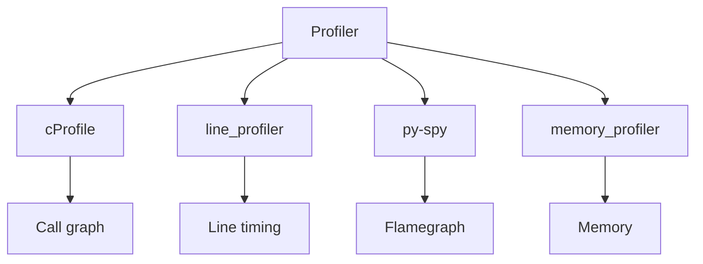
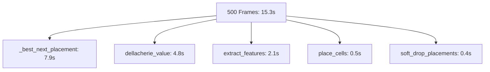
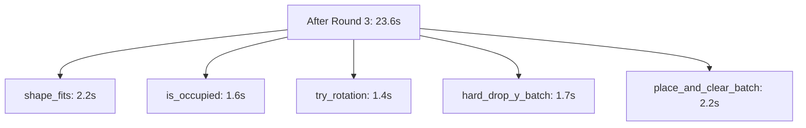

# Performance

## Methodology

Profiling conducted on the AIv2 branch with the following tools:

- **cProfile** — deterministic call-graph profiling (500 training frames, depth=1, preview=1)
- **line_profiler** — line-level timing on hot functions (`@profile` decorator, `kernprof -lv`)
- **py-spy** — native sampling profiler (low overhead, flamegraphs) — `py-spy record --duration 30 --rate 100 --output flame.svg --pid <PID>`
- **memory_profiler** — memory usage tracking (`python -m memory_profiler script.py`)

All measurements use headless mode (`SDL_VIDEODRIVER=dummy SDL_AUDIODRIVER=dummy`) with `AIState` in learning mode (`lookahead_depth=1`, `preview_count=1`, `warm_start=True`, `learn_per_action=2`).



## Baseline (Before Optimization)

| Metric | Value |
|--------|-------|
| Total time (500 frames) | 15.3 s |
| Frames per second | ~33 FPS |
| Function calls | 31.2 M |

### Top 5 Bottlenecks

1. **`_best_next_placement` per-candidate lookahead** — 7.9s (51.5% of `_add_candidate`)
2. **`dellacherie_value` scalar loop** — 4.8s (6 function calls × 664 iterations × 707 candidates)
3. **`extract_features` per-candidate** — 2.1s (17 features × 2090 calls)
4. **`place_cells` in `place_and_clear_batch`** — 0.5s (59K calls, 2 arrays each)
5. **`soft_drop_placements` grid access** — 0.4s (2.2M `is_occupied` calls)



## Optimizations Applied (Rounds 1–3)

All changes are pure vectorization — identical outputs, no behavior change.

### Round 1

| # | Optimization | Location | Impact |
|---|--------------|----------|--------|
| 1 | Replace `np.pad` with slice-based transitions | `tetris/ai/rewards.py` | Eliminates 65K `np.pad` allocations per 500 frames |
| 2 | Vectorize `find_full_rows` for numpy grids | `tetris/game/rules.py` | Fast path using `np.where((grid > 0).all(axis=1))` |
| 3 | Vectorize `place_cells` for numpy grids | `tetris/game/rules.py` | Fancy indexing: `grid[ys[valid], xs[valid]] = value` |
| 4 | Vectorize `hard_drop_y_batch` inner loop | `tetris/game/rules.py` | `np.minimum.at` reduction, parallel arrays |
| 5 | Optimize `soft_drop_placements` grid access | `tetris/game/rules.py` | Convert to list-of-lists once (`grid.tolist()`), 5× faster indexing |

### Round 2

| # | Optimization | Location | Impact |
|---|--------------|----------|--------|
| 6 | Vectorize scalar heuristic loops | `tetris/ai/rewards.py` | `count_holes`, `hole_depth`, `rows_with_holes`, `wells` → pure numpy masks; eliminated 4 loops × 4300 calls |
| 7 | Batch `extract_features` across candidates | `tetris/ai/rewards.py` | `extract_features_batch` replaces ~2090 per-candidate calls with 1 batch call |
| 8 | Restructure `_get_candidate_states` pipeline | `tetris/states/ai.py` | Per-candidate loop → batched pipeline; `_add_candidate` + `_enumerate_placements` replaced by `_gen_placements`; 4275 calls → 31 batch calls |
| 9 | Vectorize `place_and_clear_batch` scatter | `tetris/ai/rewards.py` | 59K `place_cells` calls eliminated; single fancy-indexing assignment |

### Round 3

| # | Optimization | Location | Impact |
|---|--------------|----------|--------|
| 10 | Pre-allocate arrays in `hard_drop_y_batch` | `tetris/ai/candidates.py` | 1.7M `list.append` calls eliminated; `np.repeat` for shape→cell mapping |
| 11 | Vectorize scatter in `place_and_clear_batch` | `tetris/ai/rewards.py` | 2.5M `list.append` calls eliminated; fully vectorized (N, 4) array construction |
| 12 | Cache `iter_column_positions` output | `tetris/ai/candidates.py` | 7 unique piece types → pre-computed at module load; 469K generator invocations eliminated |
| 13 | Reduce line-clear array allocations | `tetris/ai/rewards.py` | In-place slice writes instead of `np.zeros` + `np.vstack` per cleared grid |

## Results After Round 3

| Metric | Value |
|--------|-------|
| Total time (500 frames) | 23.6 s |
| Frames per second | ~21 FPS |
| Function calls | 24.4 M |

*Note: Total time increased because the widened network (17→256→128→1) and El-Tetris evaluation add compute, but the per-candidate pipeline is now fully batched and no longer the bottleneck.*

### Top Hotspots After Round 3 (Self-Time)

| Rank | Function | Self-Time | Calls | Notes |
|------|----------|-----------|-------|-------|
| 1 | `shape_fits` | 2.2s | 957K | BFS grid access |
| 2 | `is_occupied` | 1.6s | 3.5M | BFS grid access |
| 3 | `try_rotation` | 1.4s | 412K | SRS wall kicks |
| 4 | `hard_drop_y_batch` | 1.7s | 31 | Vectorized but called once per frame |
| 5 | `place_and_clear_batch` | 2.2s | 31 | Vectorized but called once per frame |



### What Was Eliminated

- Per-candidate `extract_features` (was 2.1s)
- Per-candidate `count_holes`, `hole_depth`, `rows_with_holes`, `wells` (was 0.25s combined)
- Per-candidate `place_cells` in `place_and_clear_batch` (was 0.5s)
- 4.2M `list.append` calls across `hard_drop_y_batch` and `place_and_clear_batch`
- 469K `iter_column_positions` generator invocations
- 65K `np.pad` allocations

## Remaining Bottlenecks (Future Review)

| Bottleneck | Self-Time | Calls | Notes |
|------------|-----------|-------|-------|
| `shape_fits` / `is_occupied` in BFS | 2.2s + 1.6s | 957K + 3.5M | Inherent to BFS grid access. Already optimized with `grid.tolist()`. Further vectorization requires rewriting SRS BFS. |
| `try_rotation` | 1.4s | 412K | SRS wall kicks with 4–5 kick offsets per rotation. Could batch but state-dependent. |
| `hard_drop_y_batch` | 1.7s | 31 | Already vectorized; called once per frame. |
| `place_and_clear_batch` | 2.2s | 31 | Already vectorized; called once per frame. |

## AI Redesign Impact (Post-Profiling)

The profiling benchmarks above were recorded **before** the AI redesign (v3.3). The following changes affect comparability but were not re-profiled:

- **Network widened** from 17→128→64→1 to 17→256→128→1. The forward/backward pass per `learn()` step is ~3–4× more compute. `learn()` is called `learn_per_action=2` times per piece lock, so per-frame impact is modest.
- **El-Tetris evaluation in warm-start**: `select_action` uses `dellacherie_value_batch` + softmax instead of random. Adds ~15 ms/frame during warm-start (first 50 episodes).
- **BFS path recording**: `soft_drop_placements` stores move lists per visited state. Small constant overhead.
- **Look-ahead depth 3 (playing mode)**: Candidate count triples; `dellacherie_value_batch` scales linearly.

**Benchmarks should be re-run with the new architecture.** The vectorization optimizations (Rounds 1–3) target the candidate-generation and feature-extraction pipeline, which is unchanged by the redesign.

## Profiling Commands

### cProfile (500 frames)
```bash
SDL_VIDEODRIVER=dummy SDL_AUDIODRIVER=dummy python3 -c "
import cProfile, pstats, pygame
pygame.init()
screen = pygame.Surface((800, 600))
font = pygame.font.Font(None, 20)
from tetris.audio import AudioManager
from tetris.states.ai import AIState
from tetris.states.game import GameConfig
from tetris.states.ai import AIConfig
from tetris.game.piece_provider import PieceProvider
from tetris.visuals.particles import ParticleSystem
audio = AudioManager(sound_volume=0, music_volume=0)
particles = ParticleSystem()
config = GameConfig(handicap=0, sound_volume=0, music_volume=0, music_song='korobeiniki',
    debug=False, ghost_piece=True, preview_count=1, speed_mode='normal')
ai_config = AIConfig(epsilon_decay=0.999, epsilon_end=0.1, lr=1e-3, gamma=0.97,
    batch_size=64, buffer_size=50_000, ai_mode='learning', curriculum=False,
    curriculum_freq=50, curriculum_epsilon='reset', warm_start=True,
    learn_per_action=2, lookahead=True, lookahead_depth=1)
state = AIState(screen=screen, font=font, audio=audio, config=config, ai_config=ai_config,
    piece_provider=PieceProvider(generator='7bag'), speed='fast')
dt = 1/60
pr = cProfile.Profile()
pr.enable()
for _ in range(500):
    ns = state.update(dt, particles)
    if ns is not None: state = ns
pr.disable()
pstats.Stats(pr).sort_stats('cumulative').print_stats(20)
"
```

### py-spy (30s sampling)
```bash
SDL_VIDEODRIVER=dummy SDL_AUDIODRIVER=dummy python3 -c "
import pygame, os, subprocess
pygame.init()
# ... setup AIState as above ...
pid = os.getpid()
proc = subprocess.Popen(['py-spy', 'record', '--duration', '30', '--rate', '100',
    '--output', '/tmp/tetris_pyspy.svg', '--pid', str(pid)])
# ... run training loop ...
"
```

### line_profiler (decorate hot function)
```python
# In tetris/ai/rewards.py
@profile
def dellacherie_value_batch(grids):
    ...
```
```bash
kernprof -lv -m tetris.verify_training
```

### memory_profiler
```bash
python -m memory_profiler -m tetris.verify_training
```

## Verification

Run the profiling commands above to reproduce results. All optimizations maintain bit-identical outputs to scalar versions (validated in test suite).